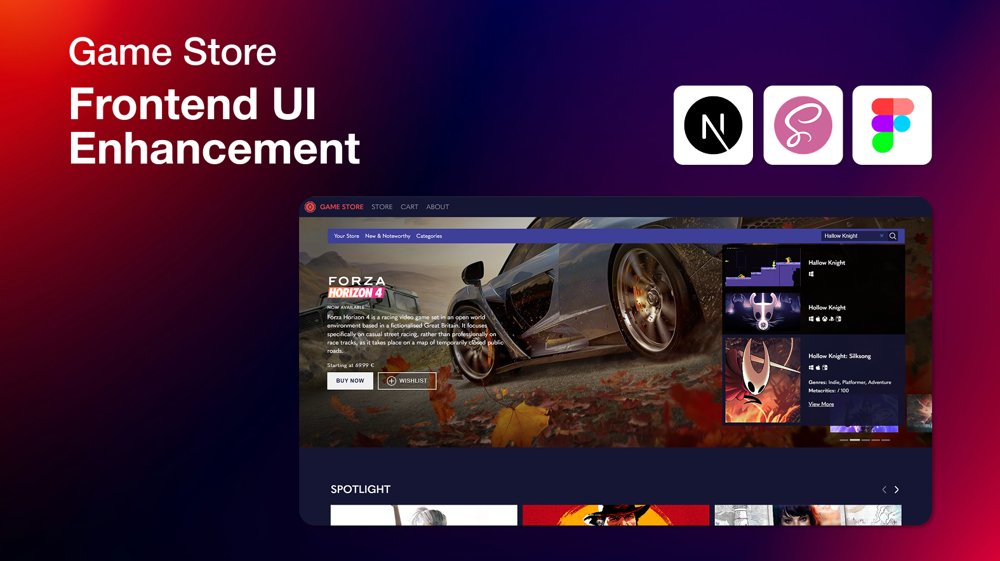

# 🎮 Video Game Store – Steam UI/UX Rehancement

### 🧠 Introduction

As a passionate video game lover and long-time Steam user, I've always felt that Steam's interface—while iconic—is cluttered, dated, and unintuitive in terms of user flow. Navigation can often feel overwhelming, and key information isn't always front and center. So I thought to myself: What would a modern, user-focused redesign of Steam look like?

That's the idea behind this project. It's not meant to replicate Steam's backend complexity, but to explore and improve the UI and UX of the Steam platform. The project focuses on the visual layout, interactivity, responsiveness, and overall feel of the store—reimagining how users browse, discover, and interact with games. The goal is a sleek, smooth, and intuitive user experience that puts content and clarity first.

### ⚠️ Disclaimer

This project is still in active development, and far from finalized. While the foundation is solid, there's still a lot to add, refine, and optimize. That said, here's what currently works and is available:

- ✅ A viable landing page with modern layout, smooth animations, swipers, and well-structured sections focused on meaningful content.
- ✅ A functional store layout that allows users to:
  - Browse through a collection of games
  - Use search and filtering functionality
  - Navigate through paginated content
- ✅ A game details page where users can view product information and add a game to their cart.

> Keep in mind: while core functionality is being implemented, the focus here is on design and user interaction rather than backend logic or full-scale commercial features.

### 💻 Tech Stack

This project is built using Next.js for fast, server-side rendered React applications and SASS for modular, scalable, and maintainable styling. It leverages the power of [RAWG.IO](https://rawg.io/apidocs)'s API to fetch real-world video game data, allowing the UI to present dynamic content such as titles, genres, ratings, and more—keeping the experience as authentic and content-rich as possible.

---

### Contact Me

### 📬Email: ganchev.professional@gmail.com

### 📌LinkedIn: [www.linkedin.com/in/alex-ganchev](https://www.linkedin.com/in/alex-ganchev)

---
